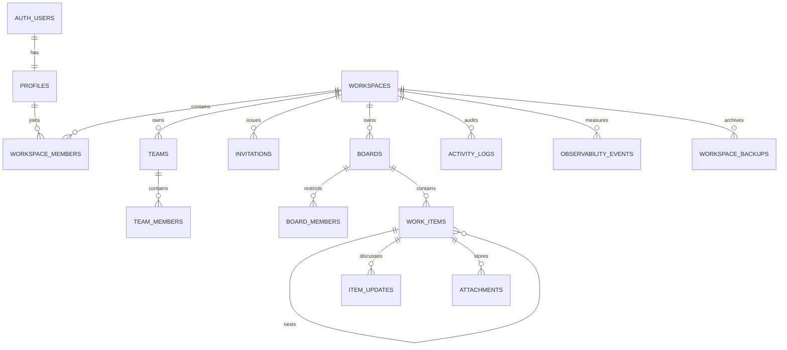

# MondayFlow Architecture

## Product boundary

MondayFlow is a multi-tenant work management application. A user can belong to multiple workspaces, and each workspace owns boards, teams, invitations, files, activity, and membership rules.

The browser never receives a service-role key. Authentication uses Supabase Auth, structured data uses Postgres with Row Level Security, file bytes use a private Supabase Storage bucket, and live board changes use Supabase Realtime.

## Runtime

| Layer | Technology | Responsibility |
| --- | --- | --- |
| Web client | React + TypeScript + Vite + PWA | Product UI, optimistic interactions, offline queue, authenticated Supabase client |
| Identity | Supabase Auth | Email/password, Google OAuth, session refresh, user identity |
| Database | Supabase Postgres | Workspaces, membership, boards, items, updates, invitations, audit records |
| Authorization | Postgres RLS | Enforce workspace and board access for every query |
| Files | Supabase Storage | Private item attachments and workspace backup objects |
| Live updates | Supabase Realtime | Board item, update, member, and activity invalidation |
| Server workflows | Supabase Edge Functions | Email delivery, scheduled jobs, integrations, SCIM, billing webhooks, and backups |

## Data model

## Request flow

1. Supabase Auth restores or creates the user session.
2. `bootstrap_account()` creates a profile and first workspace for a new account.
3. The client loads only workspaces visible through `workspace_members` RLS.
4. Selecting a board scopes all item, update, attachment, and realtime queries to that board ID.
5. Mutations are checked again in Postgres through `can_edit_board()` or workspace role helpers.
6. Activity entries are created by the application and protected by workspace RLS.

## Security decisions

- Authorization is enforced in Postgres, not inferred from hidden buttons.
- `owner`, `admin`, `member`, `viewer`, and `guest` are workspace roles.
- Main boards are visible to workspace members; private and shareable boards require explicit board membership unless the user is a workspace owner/admin.
- Attachment paths begin with the board ID and are checked through the same board-access helper.
- Invitation tokens are random, expire, and can only be accepted by the invited email address.
- Phase 2-6 configuration uses versioned workspace JSON, while queues, public responses, identity tokens, integration events, and billing remain normalized security-sensitive tables.
- Email, webhook, OAuth, SCIM, and Stripe execution lives in Edge Functions. The browser never receives provider secrets or the service-role key.
- Public Forms use narrow security-definer functions rather than anonymous table policies.
- Demo mode is explicitly local and is never treated as production data.

## Deployment environments

| Environment | Data source | Purpose |
| --- | --- | --- |
| Local demo | Browser-local fixture | UI development without credentials |
| Development | Dedicated Supabase project | Schema testing and integration QA |
| Production | Separate Supabase project | Real users and durable data |

Development and production must never share service-role credentials or database projects.

## Phase boundaries

Phases 0-1 deliver the secure multi-tenant core. Phase 2 adds board customization. Phase 3 adds the automation event and job system. Phase 4 adds credential-gated integrations. Phase 5 adds Docs, Forms, Canvas, inbox, and portfolio workload. Phase 6 adds identity provisioning, retention, export, and billing controls. Phase 7 adds PWA/mobile delivery, offline mutation replay, observability, and backup/restore.

External provider activation remains environment-specific: a connection is only marked ready until OAuth, token-vault, email, identity-provider, or payment credentials are configured and verified.
